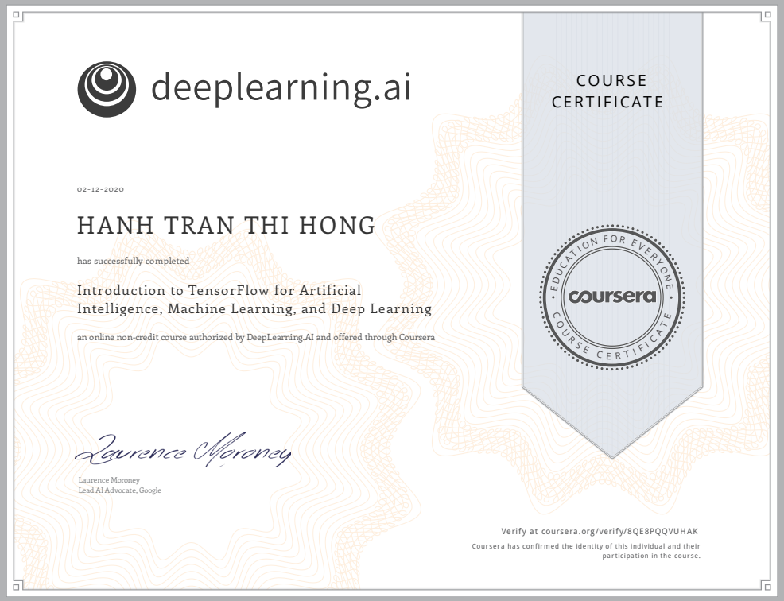
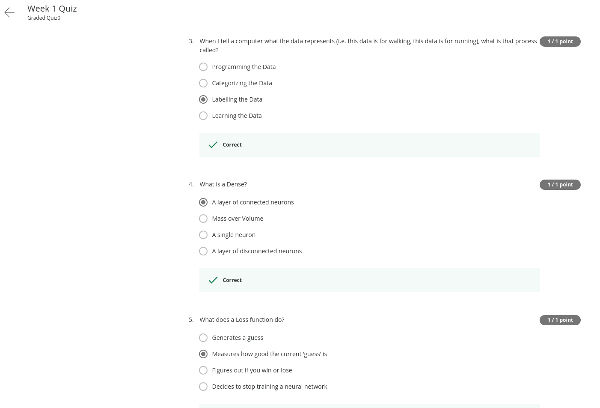
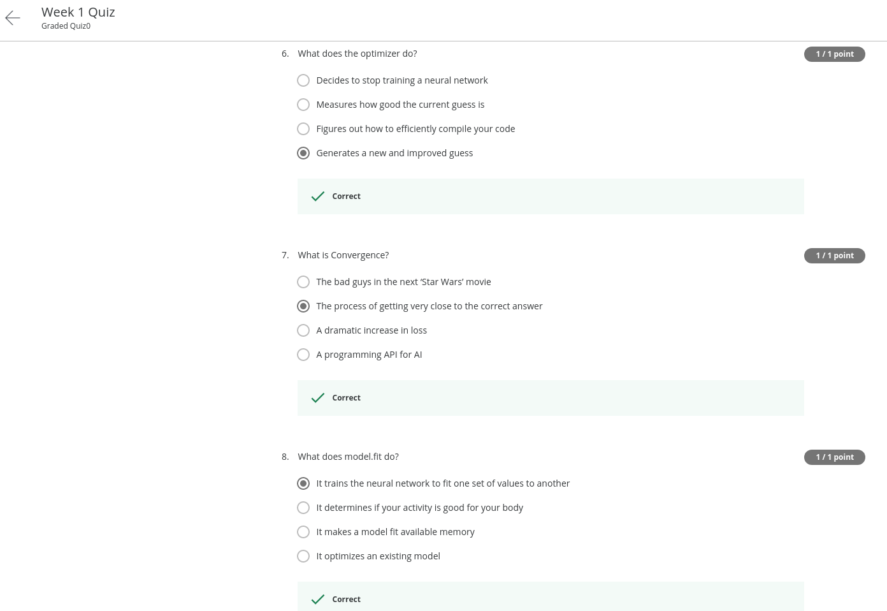
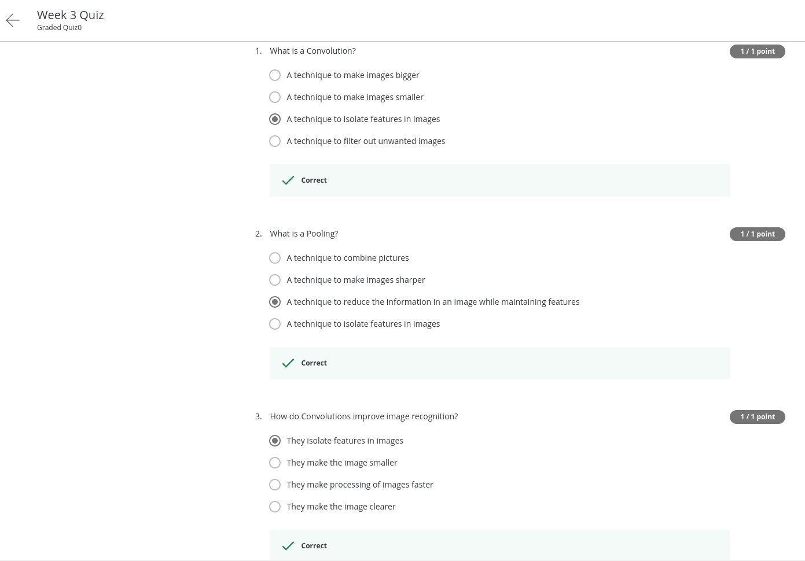
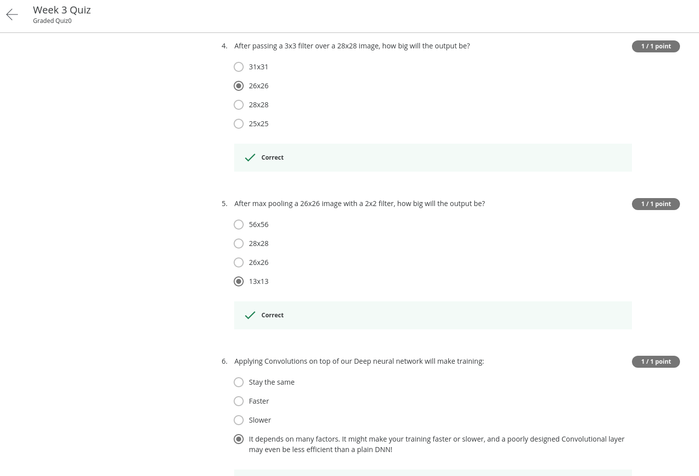
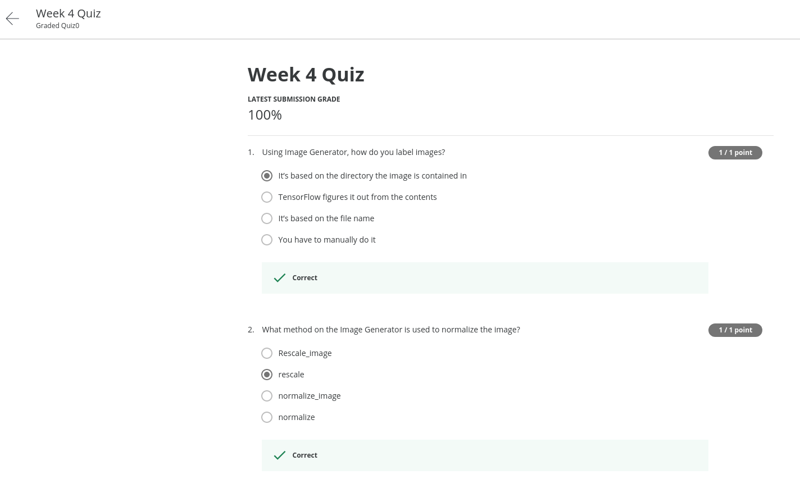
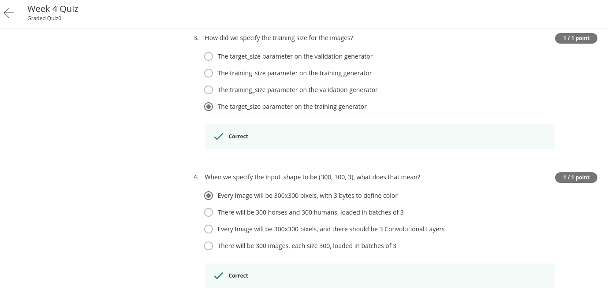
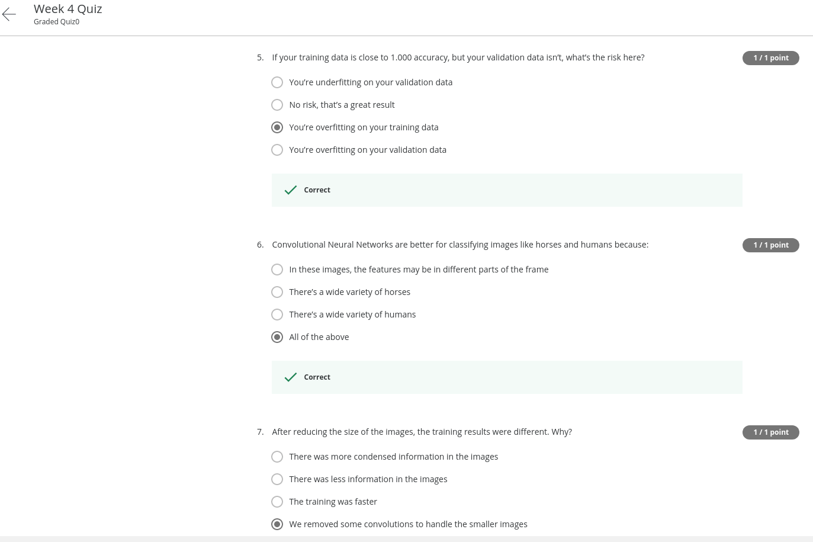

# Course 1: Introduction to TensorFlow for Artificial Intelligence, Machine Learning, and Deep Learning

**_Course Link_**: [Introduction to TensorFlow for Artificial Intelligence, Machine Learning, and Deep Learning](https://www.coursera.org/learn/introduction-tensorflow)

## Achievement goal:

    

## Solution

### Week 1

- Quiz:
    

        
    

    

        
    

    

        
    

- [Programming assignment]().

### Week 2

- Quiz:
    

        
    

    

        
    

    

        
    

- [Programming assignment]().

### Week 3

- Quiz:
    

        
    

    

        
    

- [Programming assignment]().

### Week 4

- Quiz:
    

        
    

    

        
    

    

        
    

- [Programming assignment]().

## Contributors:

- 🐮 [@honghanhh](https://github.com/honghanhh)
- 🐔 [@tiena2cva](https://github.com/tiena2cva)
