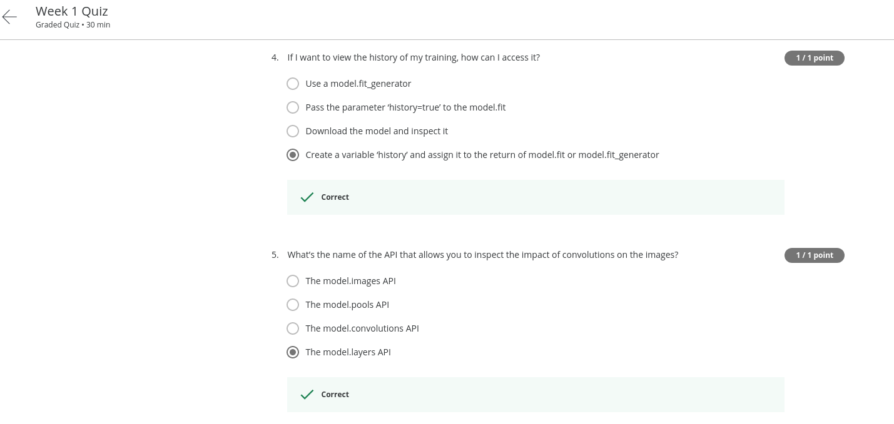
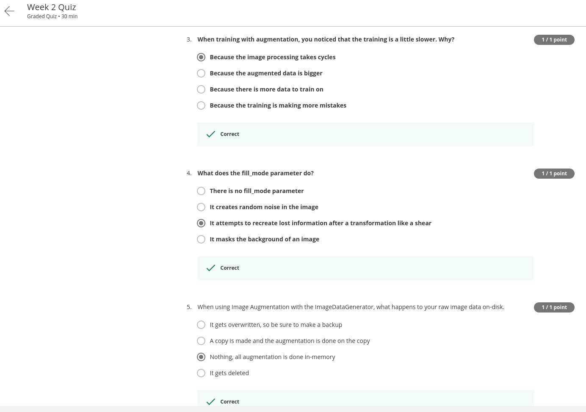
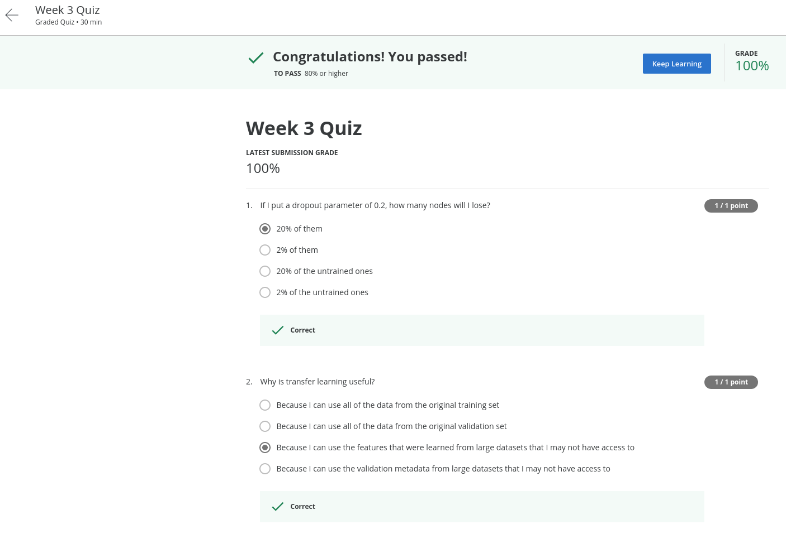
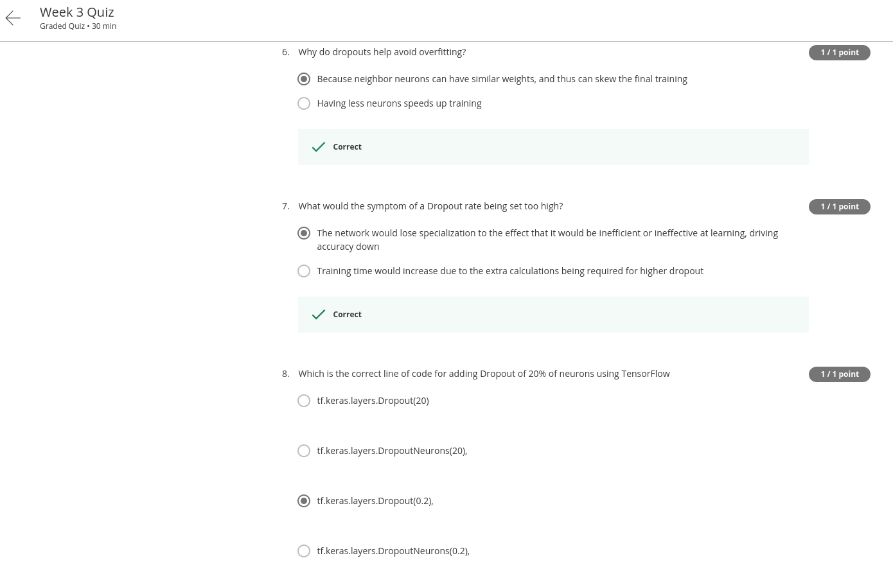

# Course 2: Convolutional Neural Networks in TensorFlow

**_Course Link_**: [Convolutional Neural Networks in TensorFlow](https://www.coursera.org/learn/convolutional-neural-networks-tensorflow)

## Achievement goal:

    

## Solution

### Week 1

- Quiz:
    

        
    

    

        
    

    

        
    

- [Programming assignment](https://github.com/GafBof/tensorflow_deeplearning.ai/blob/main/Course%202:%20Convolutional%20Neural%20Networks%20in%20Tensorflow/Week%201/Exercise_1_Cats_vs_Dogs_Question-FINAL.ipynb).

### Week 2

- Quiz:
    

        
    

    

        
    

    

        
    

- [Programming assignment](https://github.com/GafBof/tensorflow_deeplearning.ai/blob/main/Course%202:%20Convolutional%20Neural%20Networks%20in%20Tensorflow/Week%202/Exercise_2_Cats_vs_Dogs_using_augmentation_Question-FINAL.ipynb).

### Week 3

- Quiz:
    

        
    

    

        
    

    

        
    

- [Programming assignment](https://github.com/GafBof/tensorflow_deeplearning.ai/blob/main/Course%202:%20Convolutional%20Neural%20Networks%20in%20Tensorflow/Week%203/Exercise_3_Horses_vs_humans_using_Transfer_Learning_Question-FINAL.ipynb).

### Week 4

- Quiz:
    

        
    

    

        
    

    

        
    

- [Programming assignment](https://github.com/GafBof/tensorflow_deeplearning.ai/blob/main/Course%202:%20Convolutional%20Neural%20Networks%20in%20Tensorflow/Week%204/Exercise_4_Multi_class_classifier_Question-FINAL.ipynb).

## Contributors:

- 🐮 [@honghanhh](https://github.com/honghanhh)
- 🐔 [@tiena2cva](https://github.com/tiena2cva)
